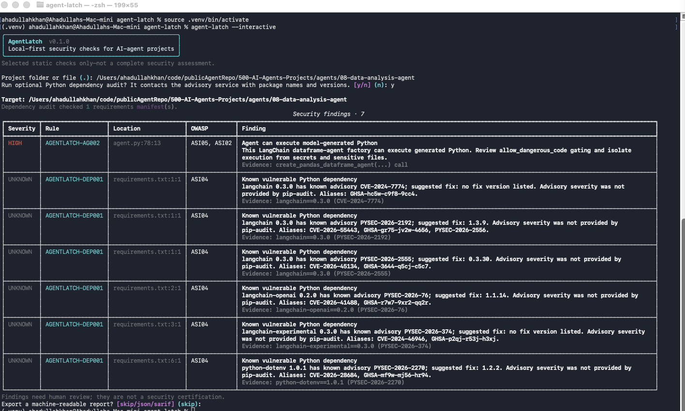

# AgentLatch — Local-First AI Agent Security Scanner

**Find selected security risks in AI-agent projects before you run or deploy them.** AgentLatch is an open-source, local-first AI agent security scanner that checks Python source and supported configuration files, optionally audits pinned Python dependencies, and reports evidence in your terminal, JSON, or SARIF.



> **Project status: early proof of concept.** AgentLatch is not a complete vulnerability scanner, runtime protection system, security score, or certification. A clean scan means only that the enabled checks did not report a finding.

AgentLatch aims to make AI-agent security checks approachable for developers working with agentic AI. The first version focuses on a small, explainable set of static checks. Framework integrations, runtime authorization, policy enforcement, and evaluations are future layers—not capabilities this scanner currently provides.

## Why AgentLatch?

AI agents combine model-generated decisions with tools, credentials, code execution, and external data. Traditional code and dependency checks are useful, but they do not by themselves explain agent-specific risks. AgentLatch is a small starting point: run selected checks locally, inspect the exact file and evidence, and map relevant findings to OWASP Agentic Top 10 categories.

The goal is to grow in layers:

1. **Now — local scanner:** focused source-pattern checks, optional Python dependency advisories, and portable reports.
2. **Next — broader static and evaluation checks:** more tested rules, framework adapters, and reproducible security test cases.
3. **Later — runtime controls:** a separate policy and audit layer for agent actions, with explicit adapters and enforcement boundaries.

These layers will remain clearly distinguished: detecting a risky pattern is not the same as testing agent behavior, and neither alone guarantees runtime enforcement.

## What it checks today

| Rule | Detection | OWASP Agentic mapping |
|---|---|---|
| `AGENTLATCH-PY001` | Direct Python `eval()` and `exec()` calls | ASI05 Unexpected Code Execution; ASI02 Tool Misuse & Exploitation |
| `AGENTLATCH-PY002` | `subprocess.*(..., shell=True)` calls | ASI05 Unexpected Code Execution; ASI02 Tool Misuse & Exploitation |
| `AGENTLATCH-PY003` | Calls with a literal `verify=False` argument | ASI02 Tool Misuse & Exploitation |
| `AGENTLATCH-AG001` | CrewAI `Agent(..., allow_delegation=True)` review hint | ASI02 Tool Misuse & Exploitation; ASI03 Identity & Privilege Abuse |
| `AGENTLATCH-AG002` | LangChain `create_pandas_dataframe_agent(...)` code-execution capability | ASI05 Unexpected Code Execution; ASI02 Tool Misuse & Exploitation |
| `AGENTLATCH-SEC001` | Credential-like quoted assignments; matched value is redacted | ASI03 Identity & Privilege Abuse; ASI04 Agentic Supply Chain Vulnerabilities |
| `AGENTLATCH-DEP001` | Known advisory for a package in an audited requirements file | ASI04 Agentic Supply Chain Vulnerabilities |

Rule behavior and known blind spots are documented in [docs/RULES.md](docs/RULES.md). OWASP mappings are informational references, not an OWASP endorsement or certification.

## Install

Requires Python 3.11 or newer. Install AgentLatch in its own virtual environment; do not install it into the project being scanned.

### macOS and Linux

```sh
git clone https://github.com/AgentLatch/agent-latch.git
cd agent-latch
python3 -m venv .venv
source .venv/bin/activate
python -m pip install --upgrade pip
python -m pip install -e .
```

### Windows PowerShell

```powershell
git clone https://github.com/AgentLatch/agent-latch.git
Set-Location agent-latch
py -3 -m venv .venv
.\.venv\Scripts\Activate.ps1
python -m pip install --upgrade pip
python -m pip install -e .
```

For development dependencies and tests, install `.[dev]`; for the optional dependency audit, install `.[audit]`.

## Scan an agent project

### Guided interactive mode

```sh
agent-latch --interactive
```

The wizard asks for a target directory or file, separately asks whether to run the optional networked dependency audit, displays findings in a severity-colored table, and offers JSON or SARIF export. Dependency auditing defaults to **No**.

### Direct command-line mode

```sh
# Scan source/configuration patterns only; no network call
agent-latch /path/to/agent-project

# Include an optional audit of supported requirements*.txt files
agent-latch /path/to/agent-project --dependencies

# Save a structured JSON report or GitHub-compatible SARIF report
agent-latch /path/to/agent-project --format json --output report.json
agent-latch /path/to/agent-project --format sarif --output results.sarif

# Return a non-zero exit code on medium-or-higher findings;
# findings with unknown severity also fail closed
agent-latch /path/to/agent-project --fail-on medium
```

Use `agent-latch --help` to see all options. The existing CLI can run in scripts and CI without interactive prompts.

### Example: scan one agent from a collection

```sh
agent-latch /path/to/500-AI-Agents-Projects/agents/08-data-analysis-agent
```

To include dependency auditing, install the optional extra and explicitly enable it:

```sh
python -m pip install -e ".[audit]"
agent-latch /path/to/500-AI-Agents-Projects/agents/08-data-analysis-agent --dependencies
```

## Dependency-audit privacy and coverage

The optional integration uses [pip-audit](https://github.com/pypa/pip-audit) for known Python package advisories. It currently reads `requirements*.txt` files. It does **not** currently audit every dependency format, including `pyproject.toml` project metadata and all lockfile formats.

When enabled, package names and versions from supported manifests are sent to pip-audit's configured vulnerability service (PyPI by default). AgentLatch does not upload the scanned source tree, install target-project packages, or ask pip to resolve dependency trees in this mode; it uses `--no-deps` and `--disable-pip`. Exact-pinned requirements are needed for this no-resolution workflow. Review organizational policy before querying private package names.

The advisory feed supplies advisory IDs and fix versions, but the current pip-audit JSON data does not provide a normalized severity rating. Therefore dependency findings are shown with **unknown severity**, not assigned an invented HIGH or CVSS rating. Duplicate copies of the same package/version/advisory in a manifest are reported once. An advisory match is a reason to investigate; it does not by itself establish exploitability in a particular application. `--fail-on` treats unknown-severity findings as fail-closed when any threshold other than `none` is selected.

## Reports and data handling

- Source and configuration checks run locally; they do not call an LLM or upload scanned source.
- The optional dependency audit is the exception: it makes network requests containing package names and versions.
- Secret-like values detected by the initial rule are not copied into finding evidence. This is not a guarantee that reports contain no sensitive information.
- Reports include target paths, file paths, line numbers, rule descriptions, and evidence. Review reports before sharing or committing them.
- The scanner skips common environment/build directories and files larger than 1 MB. Its coverage depends on these explicit limits and implemented rules.
- SARIF is an output format only. This project does not yet provide a maintained GitHub Action or automatic code-scanning upload workflow.

## Important limitations

- Rules are static heuristics: aliases, wrappers, dynamic imports, generated code, non-Python languages, and runtime behavior can be missed.
- Findings can be false positives. A code-pattern match is not proof that an attacker can exploit it.
- No findings does not mean the agent is secure. AgentLatch does not inspect prompts, model behavior, deployment configuration, live tool calls, or complete transitive dependency state.
- OWASP category IDs help organize selected findings; the mapping is not a compliance assessment, OWASP affiliation, or certification.
- AgentLatch currently scans projects; it is **not** a Python runtime library that intercepts agent actions and does not yet enforce policies.

## Development and tests

```sh
python3 -m venv .venv
source .venv/bin/activate
python -m pip install -e ".[dev,audit]"
python -m pytest
ruff check .
```

Tests use synthetic fixtures and mock the dependency-audit subprocess; the normal test suite does not query vulnerability services.

## Roadmap

The longer-term direction is a layered AI-agent security toolkit. Each layer should have its own stated coverage and tests:

- **Scanner (current):** expand well-scoped rules, language support, dependency manifest support, and SARIF quality.
- **Evaluation (planned):** reproducible test cases for selected agent security behaviors, with transparent methodology and no single opaque “safe” score.
- **Runtime policy and audit (planned, separate component):** authorize, deny, or require approval for tool actions through explicit, framework-specific adapters. Controls only protect execution paths that cannot bypass enforcement.
- **Marketplace and hosted scanning (future, not implemented):** require explicit consent, minimal repository access, retention/deletion policy, tenant isolation, and security review before accepting private source code.

The project will not claim to be an industry standard or a universal security guarantee. Interoperability, independent review, transparent tests, and community adoption must come before such claims.

## Contributing and security reports

See [CONTRIBUTING.md](CONTRIBUTING.md) for development and rule authoring, and [SECURITY.md](SECURITY.md) for responsible vulnerability reporting. Please submit synthetic test fixtures rather than real secrets or confidential source code.

## Name and standards references

AgentLatch is an independent open-source project. It references selected categories from the [OWASP Top 10 for Agentic Applications 2026](https://genai.owasp.org/resource/owasp-top-10-for-agentic-applications-for-2026/) where useful. OWASP is not affiliated with or endorsing AgentLatch.
